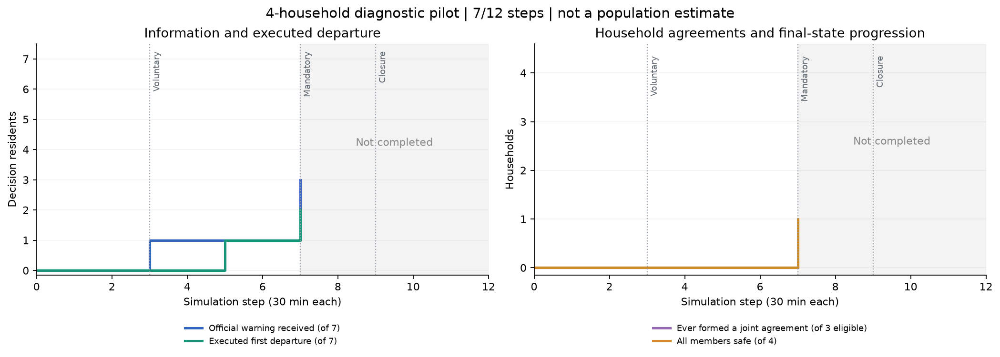
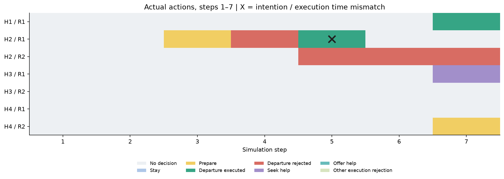

# 主实验试跑预览与代码核查

这次使用修改后的代码运行真实 DeepSeek-V4-Flash。完成 7/12 步，运行状态为 STOPPED_FOR_IMPLEMENTATION_REVIEW。这是四户诊断试跑，不是正式主实验，也不是方法优势或真实性验证。

## 先回答旧代码能不能直接用

不能直接用于改造后的正式实验。本次修改的是单独的源码副本，具体差异见 implementation_changes.patch；没有覆盖旧代码或旧结果。

旧主实验正式目录核查如下。提前执行指执行记录的 step 小于关联约定的 depart_step。

| 规模 / 种子 | 成功出发记录 | 提前执行记录 | 重复出发成员 | 终态位置表缺失成员 |
|---|---:|---:|---:|---:|
| 24 户 / 7201 | 12 | 12 | 0 | 6 |
| 24 户 / 8301 | 16 | 16 | 3 | 5 |
| 24 户 / 9401 | 13 | 13 | 1 | 4 |
| 100 户 / 101 | 57 | 52 | 11 | 20 |
| 100 户 / 202 | 57 | 54 | 17 | 32 |

位置缺失都发生在非决策成员上：依据初始化代码的默认家庭位置与执行日志，可补出部分状态统计；但提前执行和重复出发会改变后续行为，不能通过删除记录或重算百分比恢复原本应该发生的过程。五次主实验运行均受提前执行影响；用于修改后过程主张时需补跑。消融和跨模型使用另一套居民/世界适配器，本次没有证明它们受到同一问题影响，也没有启动重跑。

## 本次具体设置

四户取自原画像第 1、2、5、7 户，分别覆盖独居、双人、有照护成员、无车家庭；共有 12 名成员、7 名决策居民。沿用原事件时刻（第 3/7/9 步）和模型设置，缩短到 12 步。网络按四户重建，本次网络密度与 24/100 户不具有可比性。详细配置和停止规则见《试跑设置与修改说明》。

## 已完成步骤的记录（不能作为正式效果结果）

| 家庭 | 总人数 / 决策人数 | 车辆 | 已到安全区 | 终态 |
|---|---:|---:|---:|---|
| H1 | 1 / 1 | 1 | 1 | 全员安全 |
| H2 | 2 / 2 | 1 | 1 | 部分安全 |
| H3 | 6 / 2 | 1 | 0 | 尚无人到达安全区 |
| H4 | 3 / 2 | 0 | 0 | 尚无人到达安全区 |

本轮 6 次新请求成功，另有 3 次来自真实模型响应缓存；完成的时间步中共提交 9 次决策。累计 3/7 人收到官方信息，2/7 人有核实后的首次实际出发。明确多人约定涉及 0/3 个具备多人决策机会的家庭；自动单人约定 2 个，消息形成约定 0 个。

本次检出的重复出发、终态后决策或位置/执行不一致及当前出发意图时间不一致共 1 项；终态未知成员 0 人。该检查不等于所有实现问题均已排除。

第一幅图分别画居民人数和家庭数，不把二者合成转化漏斗。线没有变化就保留水平线，不制造上升趋势。

第二幅图显示每位居民每一步实际提出/执行的行动。黑色叉号标出实际执行与当下出发意图不一致的记录，这不是成功行为证据。灰色表示没有决策，不等于选择留守。求助或帮助只有动作记录时，不能解读为已经获得交通或完成救助。

## 试跑暴露的问题和下一版需要改什么

- 本轮在第 7 步后主动停止：第 5 步 H2/R1 的当前意图是第 6 步出发，执行器却匹配旧的第 5 步约定并执行。原始引擎记为 ABORTED / UNHANDLED_EXCEPTION（SIGINT），本报告另行注明人工检查停止原因，不改写原始终态。
- 首轮 real 在第 5 步接口超时、完成 4 步；real_r2 从初态重走并复用 3 次已成功真实响应，不拼接状态日志。本轮提交 9 次决策。停止时仍有在途请求，已记录 token 成本不能当最终账单。
- 【必须修：执行匹配】约定到期与当前意图时间都要符合；不同意当前出发或明确改期时，不能因为路线和车辆相同就执行旧约定。还要记录修订和需要重新同意的过程。
- 【必须修：提议对象】模型漏填同行者时不能静默补成单人并自动占用车。提议必须明确同行成员；只有明确选择单独行动，才允许自动单人出发组。不能反过来强迫所有家庭一起撤离。
- 【必须修：协商时序】第 t 步发送、下一步处理的提议要留出协商和确认时间；双方不能因正常的一步消息处理延迟就收到 depart_step_too_early。拒绝原因必须回到相关居民的下一次输入中。
- 【必须核实：持续计划】E1 的 private_process.current_plan 仍为 None。论文若要由这个主实验证明持续规划，就要把计划状态、更新和执行接入 E1；不能用 E2 有规划代替 E1 的实现。
- 原有输入、模型、场景和内核可以保留；下一版需要修改的是上述明确接口与状态规则，不能仅换汇总脚本。
- 只有确实出现多人同意的约定，才能检验约定形成到执行的统计；若数量为零，该面板目前不能承担“协调有效”的证明。
- 只有封路后发生了决策或拒绝，才能观察反馈后的调整。全部行动早于封路或没人接触封路时，这个原场景不足以展示适应过程。
- 修复版仍沿用原 E1 的行动集：seek_help/offer_help 不会自动实现跨家庭接送；private_process.current_plan 仍为 None，不能宣称本试跑验证了持续私有计划机制。
- 是否扩大运行要先依据这些具体缺口判断，不依据撤离率是否好看；本次不会自动转入全量。

## 逐户记录（全部家庭，不挑成功案例）

### H1

| 步 | 居民 | 行动 | 执行结果 / 原因 |
|---:|---|---|---|
| 7 | H1 / R1 | 提出撤离 | executed / — |

### H2

| 步 | 居民 | 行动 | 执行结果 / 原因 |
|---:|---|---|---|
| 3 | H2 / R1 | 准备 | executed / — |
| 4 | H2 / R1 | 提出撤离 | rejected / party_not_due |
| 5 | H2 / R1 | 提出撤离 | executed / — |
| 5 | H2 / R2 | 提出撤离 | rejected / no_matching_party |
| 6 | H2 / R2 | 提出撤离 | rejected / no_matching_party |
| 7 | H2 / R2 | 提出撤离 | rejected / no_matching_party |

### H3

| 步 | 居民 | 行动 | 执行结果 / 原因 |
|---:|---|---|---|
| 7 | H3 / R1 | 求助 | executed / — |

### H4

| 步 | 居民 | 行动 | 执行结果 / 原因 |
|---:|---|---|---|
| 7 | H4 / R2 | 准备 | executed / — |
